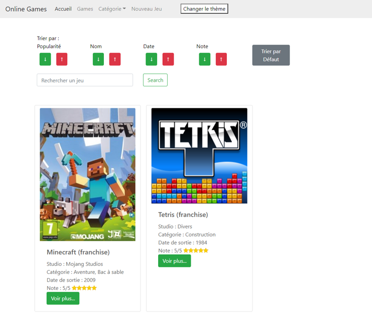
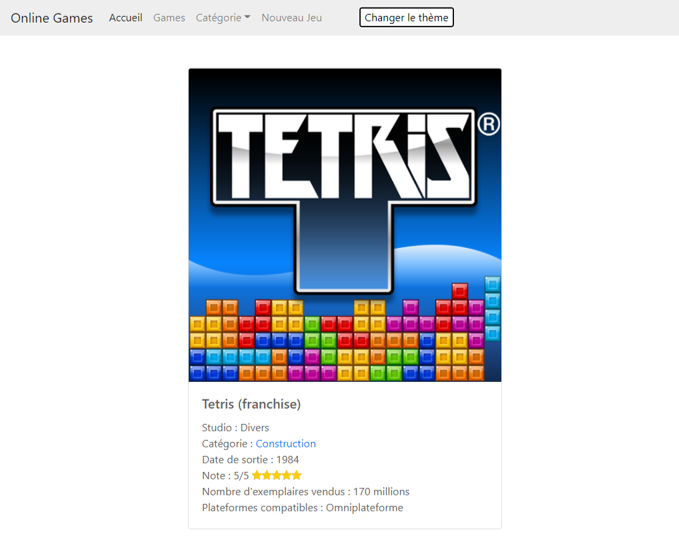
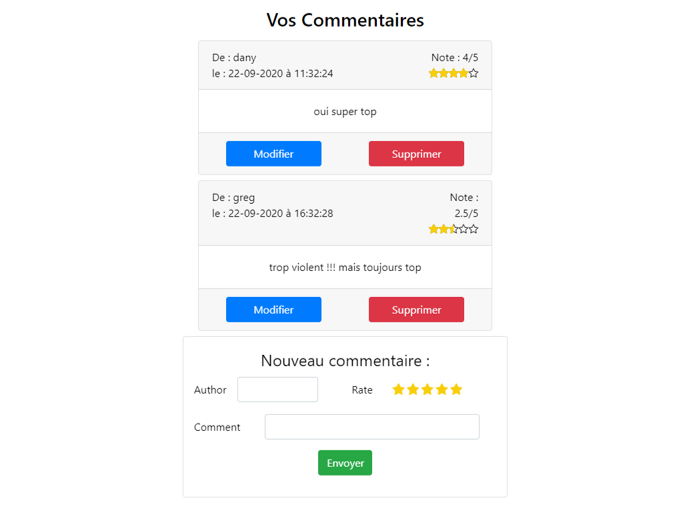
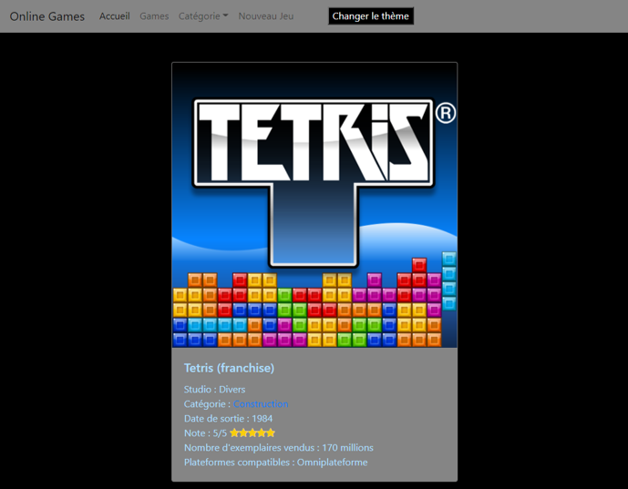
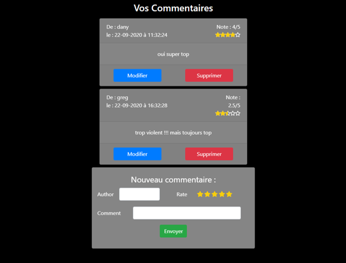
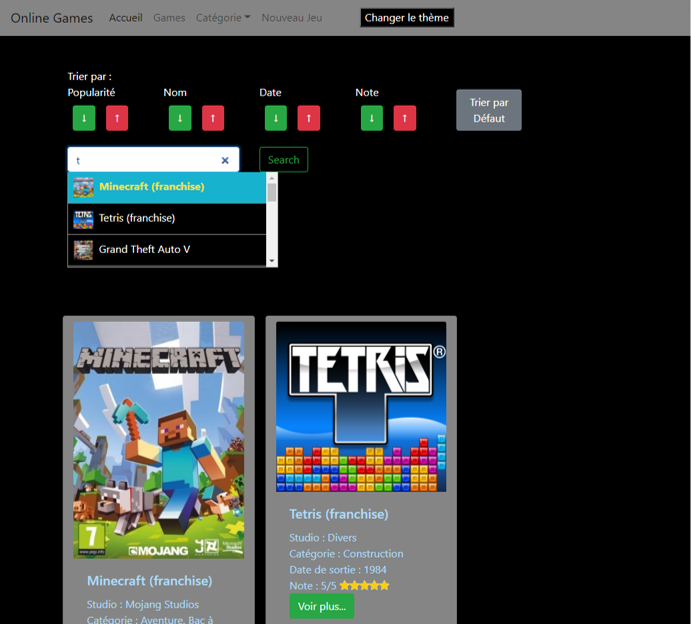

# Online Games in React JS

## Target : Create a React JS App with connexion to the following API for DATA :
## [Online_Games_API_Symfony](https://github.com/danielp67/Online_Games_API_Symfony)

---

Tools :

---
## Development Workflow :

### Phase 1 : Development of the Components from 07-09-2020 to 15-09-2020

### Phase 2 : Add call to the API from 16-09-2020 to 26-09-2020

---

## Overview :

### Home Page

### Selected Game

### Dark Mode

### Autocomplete Search Bar and Filter

